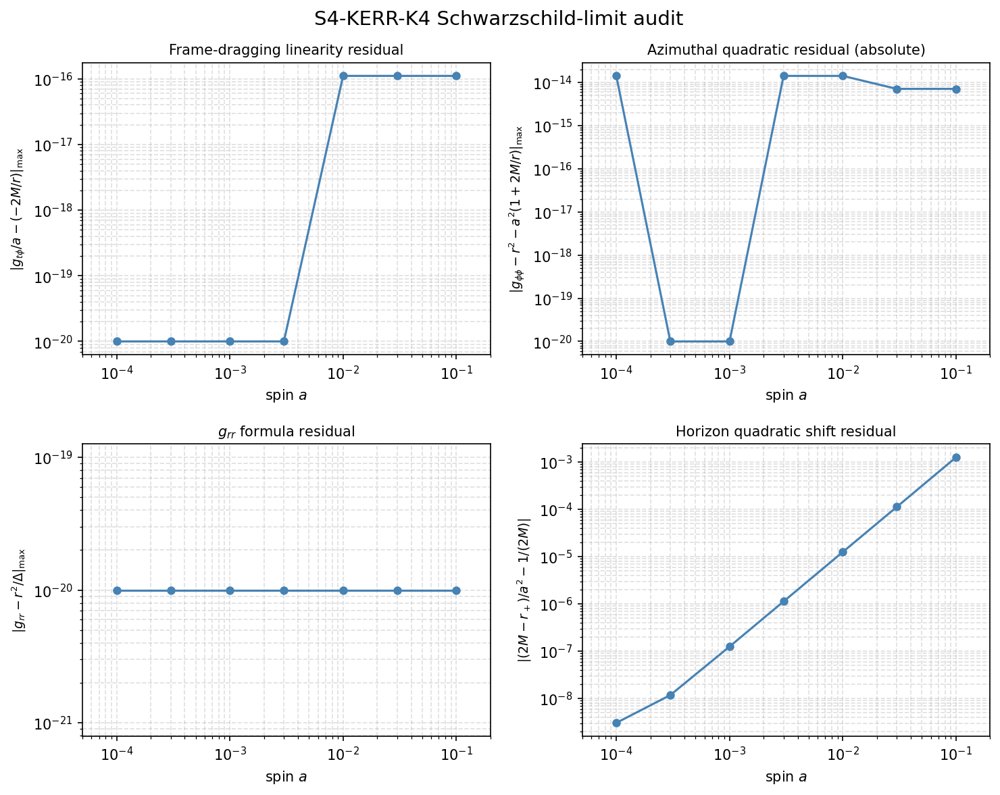

# S4-KERR-K4-SCHWARZSCHILD-LIMIT-001: Kerr Equatorial Schwarzschild-Limit Audit

Generated: 2026-05-27T17:26:28.737004+00:00

## What this is

This is a **known-truth perturbative metric audit**, not a Kerr causal solver.

It checks the analytic `a -> 0` Schwarzschild limit of the Boyer-Lindquist
equatorial metric at a fixed radial grid.

**It does NOT:**

- Implement Kerr causal inference of any kind.
- Integrate null geodesics.
- Claim global causal reachability.
- Create causal true/false relations for `a != 0`.

## Parameters

- M = 1.0, theta = pi/2 (equatorial), M = 1 (fixed)
- Spin sweep: [0.0, 0.0001, 0.0003, 0.001, 0.003, 0.01, 0.03, 0.1]
- N = 12, seed = 1959, margin = 0.35
- **Fixed radial grid** (metric evaluation): `r = [2.5, 3.0, 4.0, 6.0, 10.0]`
  (all points safely outside `r_+(a=0.1) + margin ≈ 2.345`)
- Metric formula tolerance: `1.0e-12`
- Horizon quadratic tolerance: `1.0e-03` (checked for `a <= 0.01`)

## Analytic Checks

1. **Schwarzschild limit at a=0**: g_tphi=0, g_rr=1/(1-2M/r), g_phiphi=r²
2. **Frame-dragging linearity** (a>0): g_tphi/a = -2M/r
3. **Azimuthal quadratic** (a>0): abs(g_phiphi - r² - a²*(1+2M/r)) ≤ tol
   (absolute residual; the ratio form has catastrophic cancellation for small a)
4. **g_rr formula** (all a): g_rr = r²/Δ  (identity check)
5. **Horizon quadratic shift** (0<a≤0.01): (2M-r_+)/a² → 1/(2M)

## Diagnostic Figure

The figure shows perturbative scaling residuals vs. spin a (log-scale x-axis),
excluding a=0 where division by a or a² is undefined.
Residuals 1–3 are at machine precision (same closed-form formula both sides).
Residual 4 (horizon shift) is a genuine O(a²) perturbative check.

## Summary

| Check | Result |
|-------|--------|
| **all_checks_pass** | **True** |
| positive_spin_cases_all_undecided | True |

## Per-Spin Results

| a | r_+ | r_+_shift/a² | ext? | frame_drag | gphiphi_quad | grr | horiz | schw | pass |
|---|-----|--------------|------|-----------|-------------|-----|-------|------|------|
| 0.0e+00 | 2.000000 | — | True | True | True | True | True | True | **True** |
| 1.0e-04 | 2.000000 | 0.500000 | True | True | True | True | True | True | **True** |
| 3.0e-04 | 2.000000 | 0.500000 | True | True | True | True | True | True | **True** |
| 1.0e-03 | 1.999999 | 0.500000 | True | True | True | True | True | True | **True** |
| 3.0e-03 | 1.999995 | 0.500001 | True | True | True | True | True | True | **True** |
| 1.0e-02 | 1.999950 | 0.500013 | True | True | True | True | True | True | **True** |
| 3.0e-02 | 1.999550 | 0.500113 | True | True | True | True | True | True | **True** |
| 1.0e-01 | 1.994987 | 0.501256 | True | True | True | True | True | True | **True** |

## Causal Accounting

| a | global_true | global_false | global_undecided |
|---|-------------|--------------|-----------------|
| 0.0e+00 | 1 | 60 | 5 |
| 1.0e-04 | 0 | 0 | 66 |
| 3.0e-04 | 0 | 0 | 66 |
| 1.0e-03 | 0 | 0 | 66 |
| 3.0e-03 | 0 | 0 | 66 |
| 1.0e-02 | 0 | 0 | 66 |
| 3.0e-02 | 0 | 0 | 66 |
| 1.0e-01 | 0 | 0 | 66 |

## Interpretation

- For `a=0`: the existing Schwarzschild/Kerr scaffold control behavior is preserved.
- For `a>0`: all global causal pairs remain undecided (true=0, false=0, undecided=N*(N-1)/2).
- Metric residuals 1–3 are at machine precision (~10⁻¹⁵): both sides use the same closed-form formula.
- Residual 4 (horizon shift) is a genuine perturbative check: the exact value `(2M-r_+)/a²` converges to `1/(2M)=0.5` with O(a²) error.
