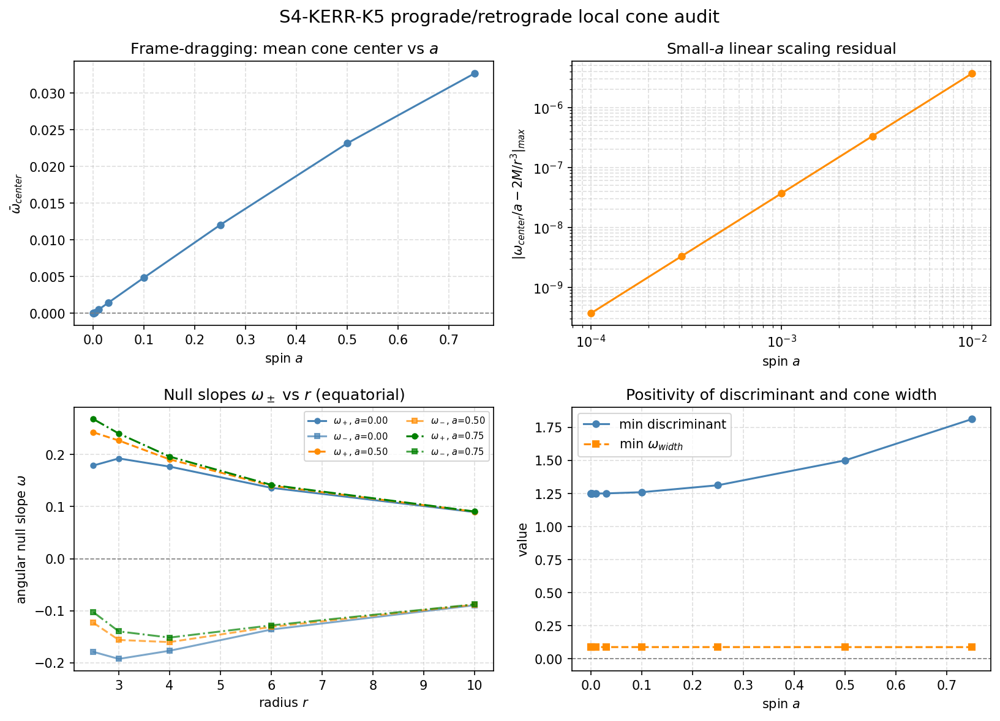

# S4-KERR-K5-PROGRADE-RETROGRADE-LOCAL-CONE-001: Kerr Equatorial Prograde/Retrograde Local Null-Slope Diagnostic

Generated: 2026-05-28T06:51:34.538517+00:00

## What this is

This is a **local null-slope diagnostic**, not a Kerr causal solver.

It measures the local prograde/retrograde asymmetry of the Kerr equatorial
light cone caused by the frame-dragging term g_tphi.

**It does NOT:**

- Implement Kerr causal inference of any kind.
- Integrate null geodesics.
- Claim global causal reachability.
- Assert global causal relations.  Local prograde/retrograde null slopes
  are **not** global causal relations.

## Parameters

- M = 1.0, theta = pi/2 (equatorial), M = 1 (fixed)
- Spin sweep: [0.0, 0.0001, 0.0003, 0.001, 0.003, 0.01, 0.03, 0.1, 0.25, 0.5, 0.75]
- N = 12, seed = 1959, margin = 0.35
- **Fixed radial grid** (metric evaluation): `r = [2.5, 3.0, 4.0, 6.0, 10.0]`
  (all points safely outside `r_+(a=0.75) + margin ≈ 2.011`)
- Metric formula tolerance: `1.0e-12`
- Small-a linear tolerance: `1.0e-04` (checked for `0 < a <= 0.01`)

## Analytic Checks

1. **Discriminant positivity** (all a): `disc = g_tphi^2 - g_tt*g_phiphi > 0`
2. **Cone width positivity** (all a): `omega_width = sqrt(disc)/g_phiphi > 0`
3. **Exact center identity** (all a): `(omega_+ + omega_-)/2 = -g_tphi/g_phiphi`
   (algebraic identity; residual ≤ 1e-12)
4. **Schwarzschild symmetry** (a=0): `omega_+ = -omega_-`
   (frame-dragging absent; residual ≤ 1e-12)
5. **Frame-dragging sign** (a>0): `omega_center = -g_tphi/g_phiphi > 0`
   (g_tphi < 0 for a>0; cone tilts in prograde direction)
6. **Linear scaling** (0<a≤0.01): `omega_center/a → 2M/r^3`
   (leading-order frame-dragging; residual ≤ 1e-4)

## Diagnostic Figure

The 2×2 figure shows:
- Panel 1: mean omega_center vs spin a (zero at a=0, positive for a>0)
- Panel 2: small-a linear scaling residual vs a (log-log, a≤0.01)
- Panel 3: omega_+ and omega_- vs r for a=0, 0.5, 0.75
  (symmetry at a=0, asymmetry for a>0)
- Panel 4: min discriminant and min cone width vs spin a

## Summary

| Check | Result |
|-------|--------|
| **all_checks_pass** | **True** |
| positive_spin_cases_all_undecided | True |

## Per-Spin Results

| a | r_+ | ext? | disc+ | width+ | fd_sign | schw_sym | lin_ok | pass |
|---|-----|------|-------|--------|---------|----------|--------|------|
| 0.0e+00 | 2.000000 | True | True | True | True | True | True | **True** |
| 1.0e-04 | 2.000000 | True | True | True | True | True | True | **True** |
| 3.0e-04 | 2.000000 | True | True | True | True | True | True | **True** |
| 1.0e-03 | 1.999999 | True | True | True | True | True | True | **True** |
| 3.0e-03 | 1.999995 | True | True | True | True | True | True | **True** |
| 1.0e-02 | 1.999950 | True | True | True | True | True | True | **True** |
| 3.0e-02 | 1.999550 | True | True | True | True | True | True | **True** |
| 1.0e-01 | 1.994987 | True | True | True | True | True | True | **True** |
| 2.5e-01 | 1.968246 | True | True | True | True | True | True | **True** |
| 5.0e-01 | 1.866025 | True | True | True | True | True | True | **True** |
| 7.5e-01 | 1.661438 | True | True | True | True | True | True | **True** |

## Causal Accounting

| a | global_true | global_false | global_undecided |
|---|-------------|--------------|-----------------|
| 0.0e+00 | 1 | 60 | 5 |
| 1.0e-04 | 0 | 0 | 66 |
| 3.0e-04 | 0 | 0 | 66 |
| 1.0e-03 | 0 | 0 | 66 |
| 3.0e-03 | 0 | 0 | 66 |
| 1.0e-02 | 0 | 0 | 66 |
| 3.0e-02 | 0 | 0 | 66 |
| 1.0e-01 | 0 | 0 | 66 |
| 2.5e-01 | 0 | 0 | 66 |
| 5.0e-01 | 0 | 0 | 66 |
| 7.5e-01 | 0 | 0 | 66 |

## Interpretation

- For `a=0`: Schwarzschild symmetry is verified; the existing scaffold
  control causal counts are preserved.
- For `a>0`: the cone tilts in the prograde direction (`omega_center > 0`),
  but all global causal pairs remain undecided
  (true=0, false=0, undecided=N*(N-1)/2).
- Metric formula residuals (checks 3, 4) are at machine precision (~10^-15):
  both sides use the same closed-form expression.
- The linear scaling check (6) is a genuine perturbative check:
  the O(a^2) correction to g_phiphi introduces a residual ~3.7e-7 at a=0.01.
