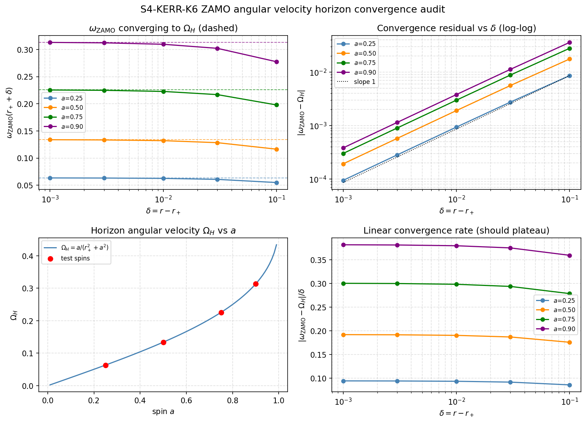

# S4-KERR-K6-ZAMO-OMEGA-HORIZON-001: ZAMO Angular Velocity Horizon Convergence Audit

Generated: 2026-05-28T07:22:03.279730+00:00

## What this is

This is a **near-horizon convergence diagnostic**, not a Kerr causal solver.

It verifies that the local ZAMO angular velocity
`omega_ZAMO = -g_tphi / g_phiphi` converges to the known-truth horizon
angular velocity `Omega_H = a / (r_+^2 + a^2)` as `r -> r_+` from outside
the horizon.

**It does NOT:**

- Cross the horizon.
- Implement Kerr causal inference of any kind.
- Integrate null geodesics.
- Claim global causal reachability.
- Convergence of omega_ZAMO to Omega_H is a **local metric identity**,
  not a causal relation.

## Connection to the K-sequence

- K5 measured omega_ZAMO asymmetry at fixed r (prograde/retrograde).
- K6 measures omega_ZAMO convergence to Omega_H near the horizon.
- Together they bridge local frame-dragging -> horizon angular velocity,
  without crossing the Hawking/Bekenstein thermodynamic guardrail.

## Parameters

- M = 1.0, theta = pi/2 (equatorial), M = 1 (fixed)
- Spins: [0.0, 0.25, 0.5, 0.75, 0.9]
- Deltas (r - r_+): [0.1, 0.03, 0.01, 0.003, 0.001]
- N = 12, seed = 1959, margin = 0.35

## Known-Truth Checks

1. **All r_eval > r_+**: near-horizon grid stays exterior (delta > 0).
2. **omega_ZAMO < Omega_H** (a>0): frame-dragging rate is below the
   horizon value for all r > r_+ (trivially True for a=0).
3. **Monotone convergence** (a>0): residuals decrease as delta -> 0,
   consistent with O(delta) convergence rate.
4. **Causal invariant**: a>0 => all global pairs undecided.

## Diagnostic Figure

The 2×2 figure shows:
- Panel 1: omega_ZAMO vs delta for each spin (convergence to Omega_H)
- Panel 2: |omega_ZAMO - Omega_H| vs delta (log-log; linear slope ~ 1)
- Panel 3: Omega_H vs spin a (analytic formula curve + test points)
- Panel 4: residual / delta vs delta (testing linear convergence rate)

## Summary

| Check | Result |
|-------|--------|
| **all_checks_pass** | **True** |
| positive_spin_cases_all_undecided | True |

## Per-Spin Results

| a | r_+ | Omega_H | mono_pass | below_pass | min_res | max_res | pass |
|---|-----|---------|-----------|------------|---------|---------|------|
| 0.00 | 2.000000 | 0.00000000 | True | True | 0.00e+00 | 0.00e+00 | **True** |
| 0.25 | 1.968246 | 0.06350833 | True | True | 9.42e-05 | 8.57e-03 | **True** |
| 0.50 | 1.866025 | 0.13397460 | True | True | 1.92e-04 | 1.76e-02 | **True** |
| 0.75 | 1.661438 | 0.22570811 | True | True | 3.00e-04 | 2.78e-02 | **True** |
| 0.90 | 1.435890 | 0.31339450 | True | True | 3.81e-04 | 3.59e-02 | **True** |

## Per-Spin Residual Tables

### a = 0.00

| delta | r_eval | omega_ZAMO | residual |
|-------|--------|------------|----------|
| 1.0e-01 | 2.100000 | 0.00000000 | 0.00e+00 |
| 3.0e-02 | 2.030000 | 0.00000000 | 0.00e+00 |
| 1.0e-02 | 2.010000 | 0.00000000 | 0.00e+00 |
| 3.0e-03 | 2.003000 | 0.00000000 | 0.00e+00 |
| 1.0e-03 | 2.001000 | 0.00000000 | 0.00e+00 |

### a = 0.25

| delta | r_eval | omega_ZAMO | residual |
|-------|--------|------------|----------|
| 1.0e-01 | 2.068246 | 0.05493613 | 8.57e-03 |
| 3.0e-02 | 1.998246 | 0.06076177 | 2.75e-03 |
| 1.0e-02 | 1.978246 | 0.06257494 | 9.33e-04 |
| 3.0e-03 | 1.971246 | 0.06322639 | 2.82e-04 |
| 1.0e-03 | 1.969246 | 0.06341416 | 9.42e-05 |

### a = 0.50

| delta | r_eval | omega_ZAMO | residual |
|-------|--------|------------|----------|
| 1.0e-01 | 1.966025 | 0.11640498 | 1.76e-02 |
| 3.0e-02 | 1.896025 | 0.12836886 | 5.61e-03 |
| 1.0e-02 | 1.876025 | 0.13207206 | 1.90e-03 |
| 3.0e-03 | 1.869025 | 0.13340020 | 5.74e-04 |
| 1.0e-03 | 1.867025 | 0.13378278 | 1.92e-04 |

### a = 0.75

| delta | r_eval | omega_ZAMO | residual |
|-------|--------|------------|----------|
| 1.0e-01 | 1.761438 | 0.19786420 | 2.78e-02 |
| 3.0e-02 | 1.691438 | 0.21690177 | 8.81e-03 |
| 1.0e-02 | 1.671438 | 0.22272750 | 2.98e-03 |
| 3.0e-03 | 1.664438 | 0.22480912 | 8.99e-04 |
| 1.0e-03 | 1.662438 | 0.22540799 | 3.00e-04 |

### a = 0.90

| delta | r_eval | omega_ZAMO | residual |
|-------|--------|------------|----------|
| 1.0e-01 | 1.535890 | 0.27747075 | 3.59e-02 |
| 3.0e-02 | 1.465890 | 0.30214910 | 1.12e-02 |
| 1.0e-02 | 1.445890 | 0.30960047 | 3.79e-03 |
| 3.0e-03 | 1.438890 | 0.31225148 | 1.14e-03 |
| 1.0e-03 | 1.436890 | 0.31301304 | 3.81e-04 |

## Causal Accounting

| a | global_true | global_false | global_undecided |
|---|-------------|--------------|-----------------|
| 0.00 | 1 | 60 | 5 |
| 0.25 | 0 | 0 | 66 |
| 0.50 | 0 | 0 | 66 |
| 0.75 | 0 | 0 | 66 |
| 0.90 | 0 | 0 | 66 |

## Interpretation

- `a=0`: omega_ZAMO = Omega_H = 0 everywhere; trivial check, True by convention.
- `a>0`: the convergence is linear in `delta = r - r_+`, consistent with
  the O(delta) Taylor expansion of omega_ZAMO around r_+.
- The residuals decrease by approximately the same factor as delta at each
  step (ratio ≈ 3 for factor-3 steps in delta).
- This audit does **not** constitute a Hawking temperature computation.
  It is a local geometric identity check, satisfying the level-A
  criterion from the Hawking consistency guardrail (AGENTS.md).
