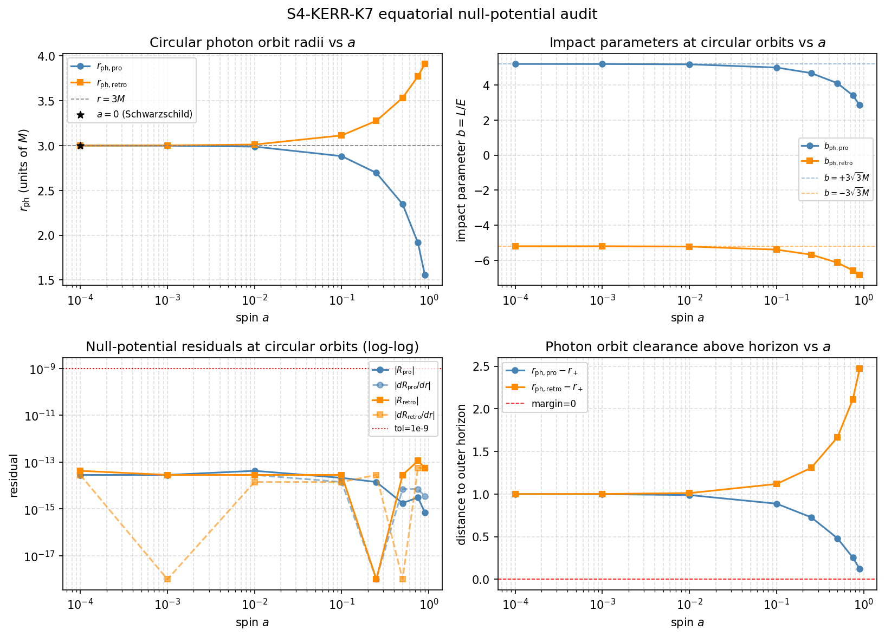

# S4-KERR-K7-EQUATORIAL-NULL-POTENTIAL-001: Kerr Equatorial Null Radial Potential Audit

Generated: 2026-05-28T08:59:00.449222+00:00

## What this is

This is an **analytic radial-potential known-truth audit**, not a Kerr causal solver.

It checks Kerr equatorial null circular photon orbit identities by verifying
that the radial potential `R(r; a, b)` and its derivative `dR/dr` vanish
at the circular photon orbit radii `r_ph_pro` and `r_ph_retro`.

**It does NOT:**

- Integrate null geodesics.
- Decide causal reachability between sprinkled events.
- Create Kerr causal relations between any events.
- Constitute a Kerr causal solver of any kind.
- Cross the Hawking/Bekenstein thermodynamic guardrail (AGENTS.md).

It is a **preflight check** before any future Kerr geodesic integration.

## Physics

Boyer-Lindquist equatorial plane, theta=pi/2, M=1:

```
R(r; a, b) = [r^2 + a^2 - a*b]^2 - Delta*(b - a)^2
Delta = r^2 - 2*M*r + a^2
dR/dr = 4*r*(r^2 + a^2 - a*b) - (2*r - 2*M)*(b - a)^2

r_ph_pro   = 2M[1 + cos((2/3)*arccos(-a/M))]
r_ph_retro = 2M[1 + cos((2/3)*arccos(+a/M))]

b_ph_pro   = a + 2*r_ph_pro*sqrt(Delta(r_ph_pro)) / (r_ph_pro - M)
b_ph_retro = a - 2*r_ph_retro*sqrt(Delta(r_ph_retro)) / (r_ph_retro - M)
```

## Connection to the K-sequence

- K5 measured local null slopes (dphi/dt) at fixed r.
- K6 measured omega_ZAMO convergence to Omega_H near the horizon.
- K7 introduces the radial null potential R(r; a, b), verifying the
  circular photon orbit structure as a preflight for geodesic integration.

## Parameters

- M = 1.0 (fixed), theta = pi/2
- Spins: [0.0, 0.0001, 0.001, 0.01, 0.1, 0.25, 0.5, 0.75, 0.9]
- N = 12, seed = 1959, margin = 0.35
- Circular orbit tolerance: 1e-09
- Schwarzschild limit tolerance: 1e-12

## Known-Truth Checks

1. Both photon orbit radii strictly outside the outer horizon `r_+`.
2. At `a=0`: `r_ph_pro = r_ph_retro = 3M`, `b_ph_pro = +3√3M`, `b_ph_retro = -3√3M`.
3. `|R(r_ph_pro; b_ph_pro)| <= tol` and `|dR/dr| <= tol` (both orbits).
4. For `a>0`: prograde orbit inside 3M, retrograde orbit outside 3M.
5. For `a>0`: `b_ph_pro > 0`, `b_ph_retro < 0`.
6. Causal accounting: `a>0` => all global pairs undecided.

## Diagnostic Figure



The 2×2 figure shows:
- Panel 1: r_ph_pro and r_ph_retro vs spin a (semilog x).
- Panel 2: b_ph_pro and b_ph_retro vs spin a (semilog x).
- Panel 3: |R| and |dR/dr| residuals vs spin a (log-log).
- Panel 4: r_ph_pro - r_plus and r_ph_retro - r_plus vs spin a (semilog x).

## Summary

| Check | Result |
|-------|--------|
| **all_checks_pass** | **True** |
| positive_spin_cases_all_undecided | True |

## Per-Spin Results

| a | r_+ | r_ph_pro | r_ph_retro | b_pro | b_retro | circ_R | circ_dR | pass |
|---|-----|----------|------------|-------|---------|--------|---------|------|
| 0 | 2.000000 | 3.000000 | 3.000000 | 5.196152 | -5.196152 | 0.00e+00 | 0.00e+00 | **True** |
| 0.0001 | 2.000000 | 2.999885 | 3.000115 | 5.195952 | -5.196352 | 2.84e-14 | 2.84e-14 | **True** |
| 0.001 | 1.999999 | 2.998845 | 3.001154 | 5.194152 | -5.198152 | 2.84e-14 | 2.84e-14 | **True** |
| 0.01 | 1.999950 | 2.988431 | 3.011525 | 5.176123 | -5.216124 | 4.26e-14 | 2.84e-14 | **True** |
| 0.1 | 1.994987 | 2.882194 | 3.113349 | 4.993107 | -5.393405 | 2.13e-14 | 1.42e-14 | **True** |
| 0.25 | 1.968246 | 2.695453 | 3.276237 | 4.675351 | -5.680114 | 1.42e-14 | 0.00e+00 | **True** |
| 0.5 | 1.866025 | 2.347296 | 3.532089 | 4.096267 | -6.138156 | 1.78e-15 | 7.11e-15 | **True** |
| 0.75 | 1.661438 | 1.916472 | 3.772303 | 3.403101 | -6.576726 | 3.11e-15 | 7.11e-15 | **True** |
| 0.9 | 1.435890 | 1.557855 | 3.910268 | 2.844421 | -6.832319 | 7.22e-16 | 3.55e-15 | **True** |

## Retrograde Residuals

| a | abs_R_retro | abs_dR_retro |
|---|-------------|--------------|
| 0 | 0.00e+00 | 0.00e+00 |
| 0.0001 | 4.26e-14 | 2.84e-14 |
| 0.001 | 2.84e-14 | 0.00e+00 |
| 0.01 | 2.84e-14 | 1.42e-14 |
| 0.1 | 2.84e-14 | 1.42e-14 |
| 0.25 | 0.00e+00 | 2.84e-14 |
| 0.5 | 2.84e-14 | 0.00e+00 |
| 0.75 | 1.14e-13 | 5.68e-14 |
| 0.9 | 5.68e-14 | 5.68e-14 |

## Causal Accounting

| a | global_true | global_false | global_undecided |
|---|-------------|--------------|-----------------|
| 0 | 1 | 60 | 5 |
| 0.0001 | 0 | 0 | 66 |
| 0.001 | 0 | 0 | 66 |
| 0.01 | 0 | 0 | 66 |
| 0.1 | 0 | 0 | 66 |
| 0.25 | 0 | 0 | 66 |
| 0.5 | 0 | 0 | 66 |
| 0.75 | 0 | 0 | 66 |
| 0.9 | 0 | 0 | 66 |

## Interpretation

- `a=0`: Schwarzschild photon sphere at `r=3M`, `b=±3√3M`; exact analytic values.
- `a>0`: prograde photon orbit moves inward (toward the horizon), retrograde moves outward.
- Residuals `|R|` and `|dR/dr|` are near floating-point noise (≪ 1e-9), confirming
  the analytic formula is correctly implemented.
- This audit does **not** constitute a causal-relation decision for any pair.
- It satisfies the level-A criterion from the Hawking consistency guardrail (AGENTS.md):
  a closed-form identity check, not a discrete pipeline rediscovery.
