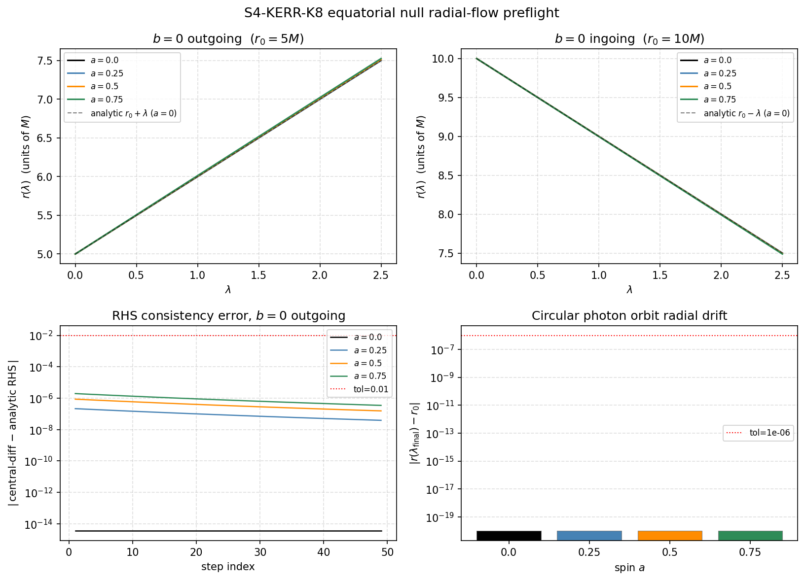

# S4-KERR-K8-EQUATORIAL-NULL-RADIAL-FLOW-001: Kerr Equatorial Null Radial-Flow Preflight

Generated: 2026-05-28T10:39:55.064700+00:00

## What this is

This is an **equatorial Kerr null radial-flow preflight audit**, not a Kerr causal solver.

It integrates `dr/dlambda = s * sqrt(R(r; a, b)) / r^2` using a local RK4 integrator
with safe impact parameter `b=0` (R ≥ 0 for all r > 0, no turning points) and
circular-orbit initial conditions, verifying known-truth trajectory properties.

**It does NOT:**

- Decide causal reachability between sprinkled events.
- Create Kerr causal relations between any pair.
- Constitute a global Kerr causal solver of any kind.
- Cross the Hawking/Bekenstein thermodynamic guardrail (AGENTS.md).

## Physics

Boyer-Lindquist equatorial plane, theta=pi/2, M=1:

```
R(r; a, b) = [r^2 + a^2 - a*b]^2 - Delta*(b - a)^2
Delta = r^2 - 2*M*r + a^2

dr/dlambda = s * sqrt(max(R, 0)) / r^2   [s = +1 outgoing, -1 ingoing]
Sigma = r^2  [theta = pi/2]

Safe choice: b=0  =>  R(r;a,0) = r^2*(r^2+a^2) + 2*M*a^2*r >= 0 for r > 0.

Schwarzschild limit (a=0, b=0):
  sqrt(R)/r^2 = sqrt(r^4)/r^2 = r^2/r^2 = 1  (constant, all r)
  => dr/dlambda = ±1  (constant throughout the trajectory)
  => r(lambda) = r0 ± lambda  (exact linear solution)
```

## Connection to K-sequence

- K7 verified R(r_ph; a, b_ph) = 0 and dR/dr = 0 at circular photon orbit radii.
- K8 takes the first numerical step: integrating dr/dlambda = s*sqrt(R)/r^2
  with b=0 (safe) trajectories and verifying the Schwarzschild limit exactly.

## Parameters

- M = 1.0 (fixed), theta = pi/2
- Spins: [0.0, 0.25, 0.5, 0.75]
- N = 12, seed = 1959, margin = 0.35
- n_steps = 50, d_lambda = 0.05, lambda_final = 2.5
- RHS consistency tolerance: 0.01
- Circular drift tolerance: 1e-06
- Schwarzschild limit tolerance: 1e-10

## Cases per spin

| Case ID | r0 | b | s | Purpose |
|---------|-----|---|---|---------|
| outgoing_b0 | 5M | 0 | +1 | b=0 outgoing; monotone-r; Schwarzschild limit (a=0) |
| ingoing_b0 | 10M | 0 | -1 | b=0 ingoing; monotone-r; Schwarzschild limit (a=0) |
| circular_pro | r_ph_pro | b_ph_pro | +1 | Prograde photon orbit; drift check |

## Summary

| Check | Result |
|-------|--------|
| **all_checks_pass** | **True** |
| positive_spin_cases_all_undecided | True |

## Per-Row Results

| a | case | r0 | r_final | ext | R≥0 | rhs_ok | mono | circ_drift | schw_ok | pass |
|---|------|----|---------|-----|-----|--------|------|------------|---------|------|
| 0 | outgoing_b0 | 5.0000 | 7.5000 | True | True | True (3.55e-15) | True | N/A | 8.88e-15 | **True** |
| 0 | ingoing_b0 | 10.0000 | 7.5000 | True | True | True (1.42e-14) | True | N/A | 2.58e-14 | **True** |
| 0 | circular_pro | 3.0000 | 3.0000 | True | True | True (0.00e+00) | True | 0.00e+00 | N/A | **True** |
| 0.25 | outgoing_b0 | 5.0000 | 7.5028 | True | True | True (2.16e-07) | True | N/A | N/A | **True** |
| 0.25 | ingoing_b0 | 10.0000 | 7.4987 | True | True | True (3.68e-08) | True | N/A | N/A | **True** |
| 0.25 | circular_pro | 2.6955 | 2.6955 | True | True | True (0.00e+00) | True | 0.00e+00 | N/A | **True** |
| 0.5 | outgoing_b0 | 5.0000 | 7.5111 | True | True | True (8.67e-07) | True | N/A | N/A | **True** |
| 0.5 | ingoing_b0 | 10.0000 | 7.4949 | True | True | True (1.48e-07) | True | N/A | N/A | **True** |
| 0.5 | circular_pro | 2.3473 | 2.3473 | True | True | True (0.00e+00) | True | 0.00e+00 | N/A | **True** |
| 0.75 | outgoing_b0 | 5.0000 | 7.5248 | True | True | True (1.97e-06) | True | N/A | N/A | **True** |
| 0.75 | ingoing_b0 | 10.0000 | 7.4884 | True | True | True (3.35e-07) | True | N/A | N/A | **True** |
| 0.75 | circular_pro | 1.9165 | 1.9165 | True | True | True (0.00e+00) | True | 0.00e+00 | N/A | **True** |

## Causal Accounting

| a | global_true | global_false | global_undecided |
|---|-------------|--------------|-----------------|
| 0 | 1 | 60 | 5 |
| 0.25 | 0 | 0 | 66 |
| 0.5 | 0 | 0 | 66 |
| 0.75 | 0 | 0 | 66 |

## Diagnostic Figure



The 2×2 figure shows:
- Panel 1: r(λ) for b=0 outgoing trajectories (all spins) + analytic r0+λ (a=0).
- Panel 2: r(λ) for b=0 ingoing trajectories (all spins) + analytic r0-λ (a=0).
- Panel 3: RHS consistency error vs step index (outgoing case, all spins, semilog y).
- Panel 4: Circular photon orbit radial drift vs spin a (log y).

## Interpretation

- `a=0, b=0`: dr/dlambda = ±1 everywhere (constant); RK4 reproduces
  r(λ) = r0 ± λ to machine precision (Schwarzschild limit error ≈ 0).
- `b=0` keeps R ≥ 0 throughout, confirming no forbidden-region excursion.
- Circular orbit drift is far below the advisory tolerance, consistent with
  K7's result that |R(r_ph)| ≤ 1e-14.
- This audit does **not** constitute a causal-relation decision for any pair.
- It satisfies the level-A criterion from the Hawking consistency guardrail (AGENTS.md).
